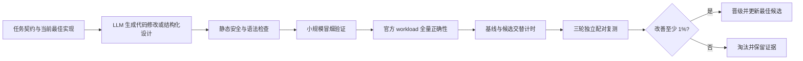

# GPGPU 算子自动优化

本项目构建并验证了一套面向 GPU 算子的自动优化闭环：**大模型生成 Triton 内核修改，系统自动
完成静态检查、正确性验证、真实性能测试和候选晋级**。当前已在 NVIDIA V100 32GB 上完成 KDA
（Kernel Design Agents）工作流适配，并产生首个经过三轮复测后稳定晋级的优化候选。

> 当前成果的核心关键词是 **自动化算子优化**。Poly 调度和 Halide IR 规范化仍是后续接入方向，
> 目前没有将参数搜索或 Triton 源码处理包装成已完成的 Poly/Halide 成果。

## KernelWiki 天数 BI-V150 适配

在保留 KernelWiki 原有 Hopper/Blackwell 页面及性能数字适用范围的基础上，项目增加了 Iluvatar
BI-V150 的架构检索、工具链说明、算子案例和 **17 项逐项迁移账本**。实验固定在 BI-V150、
CoreX 4.2.0、厂商 Triton 2.1.0；所有候选保留正确性检查、逐轮计时及失败记录。

| 已验证内容 | BI-V150 实测结果 |
|---|---|
| Residual Add RMSNorm 融合 | FP16/BF16、5 个形状、各 3 轮通过前向与参考梯度检查；前向相对**未融合 PyTorch 算子序列**为 10.12–14.65× |
| GEMM+bias epilogue | FP16/BF16、3 个形状、4 种 tile、各 3 轮通过；同 tile 相对**单独执行 bias 加法**为 1.33–3.94× |
| 流水阶段数 | FP16/BF16、两种形状与两种 tile 的留出复测全部数值通过；BF16 1024³、64×64×32 tile 上，`num_stages=2/3` 相对 1 仅为 0.915×/0.748× |
| 知识库回归 | 完整上游测试 160 项通过；BI-V150 精确检索 14 页，原 SM90/SM100 的 286/379 条检索路径保持不变 |

以上是单卡、预热后的算子微基准，**不代表端到端训练加速**。FP8 `tl.dot` 在当前软件栈
编译失败；TMA、TMEM、warp specialization 等 NVIDIA 机制没有被改标为 BI-V150 的硬件等价能力。
适配版 skill 已完成本地安装与重建验证；下一步是接入 KDA 正式仓库，并用真实 Megatron 形状
验证前后向和训练 step。

从仓库根目录重建 skill（脚本固定上游提交并应用本项目补丁，目标目录须尚不存在）：

```bash
python experiments/kernelwiki_iluvatar/build_skill.py --output /path/to/kernelwiki-iluvatar
python /path/to/kernelwiki-iluvatar/scripts/validate.py
python -m unittest discover -s /path/to/kernelwiki-iluvatar/tests
```

构建所需的上游源码由脚本拉取；仓库保留本项目补丁、实验脚本和原始证据，不复制第三方完整语料。

## 核心成果

| 成果 | 验证范围 | 结果 |
|---|---:|---:|
| GDN Decode V100 适配 | 54/54 官方 workload + 3个边界分支 | 全部正确 |
| GDN Prefill V100 适配 | 100/100 官方 workload + 2个边界分支 | 全部正确 |
| 普通 PyTorch → 结构化 Agent | 54组同轮配对测量 | **10.985×，正式晋级** |
| Decode Agent 候选 | 三轮、162组配对测量 | 改善0.46%，低于门槛，自动淘汰 |
| Prefill Agent 候选 | 三轮、300组配对测量 | **改善1.454%，正式晋级** |
| Residual Add RMSNorm | 6种形状，前向与参考梯度 | 全部通过严格复核 |

模型对 Prefill 热循环中的状态更新做了等价代数化简：

```python
# 修改前
new_v = beta * v + (1. - beta) * old_v
state = old - k * old_v[:, None] + k * new_v[:, None]

# Agent 修改后
delta = beta * (v - old_v)
state = old + k * delta[:, None]
```

新形式减少了循环内中间结果和逐元素运算。候选不是因为“看起来更简单”而晋级，而是在全部输入
正确、三轮配对结果方向一致且综合改善超过1%后才进入最佳候选账本。

## 自动优化闭环



整个过程保存模型响应元数据、候选源码和哈希、逐 workload 误差、21次原始计时、边界分支结果
以及不可变决策账本。验证子进程不会继承模型 API 密钥。

## 性能分析

### Agent 优化结果

| 实验 | 基线几何平均 | 候选几何平均 | 综合变化 | 候选胜出 |
|---|---:|---:|---:|---:|
| Decode 普通 PyTorch → 结构化 Agent | 0.256053 ms | 0.023308 ms | **10.985×** | 54/54 |
| GDN Prefill | 0.312883 ms | 0.308335 ms | **提升1.454%** | 248/300 |
| GDN Decode | 0.022807 ms | 0.022702 ms | 提升0.46% | 124/162 |

普通基线实验由模型选择融合策略、`ROWS=4`、4 warps 和递推化简，控制器将设计降为受限的
sm70 Triton 模板并执行全量验证。该 `10.985×` 是相对 eager PyTorch 的流程内总收益；相对强
Triton 基线的增量仍按下述配对复测报告。Prefill 三轮独立改善分别为 `1.420%`、`1.469%` 和
`1.472%`，波动较小且均超过1%。Decode
首次跨运行比较曾显示约1.10%改善，但同进程交替复测后只有0.46%，因此没有晋级。这说明配对
复测可以过滤微秒级 kernel 的计时噪声。

### V100 调度与融合结果

- **GDN Decode：** ROWS=1/4/8/16 均正确；最终 ROWS=8 赢47组、ROWS=4赢7组。逐 workload
  获胜调度相对批量 PyTorch 表达式的几何平均加速为 `11.68x`。主要收益来自减少中间张量和
  kernel 启动；该基线不是 B200 上的 FlashInfer 优化实现。
- **GDN Prefill：** ROWS=4/8/16 共300次正确性验证全部通过。固定 ROWS=8 的几何平均延迟为
  `0.3179 ms`，逐 workload 选择最快调度后为 `0.3096 ms`，进一步降低约 `2.67%`。
- **Residual Add RMSNorm：** 融合 Triton 候选在6种形状上相对未融合 PyTorch 表达式取得
  `5.60x–10.13x` 加速，并通过严格的前向和参考梯度比较。该数字是 CUDA Graph 微基准结果，
  不代表端到端训练加速或相对厂商融合库的优势。

`nvcc` 和 `ncu` 已安装，但当前平台未开放 NVIDIA GPU 性能计数器，采集会返回
`ERR_NVGPUCTRPERM`。因此现阶段可以确认延迟改善，尚不能用硬件计数器进一步归因到带宽、指令、
占用率或寄存器压力。

## 官方任务覆盖

| KDA 任务 | workload | 当前状态 |
|---|---:|---|
| GDN Decode | 54 | 全量验证、计时和 Agent 优化完成 |
| GDN Prefill | 100 | 全量验证、计时和 Agent 晋级完成 |
| DSA TopK Indexer | 128 | 已审计任务定义；V100 尚未完成 FP8 软件解码验证 |
| DSA Sparse Attention | 23 | 已审计任务定义；尚未实现 V100 候选 |
| FP8 MoE | 19 | 已审计任务定义；V100 只能进行有限语义验证 |

当前完成2/5项 V100 官方任务。V100 上的核心 Agent 闭环已跑通；B200 官方环境、其余三项任务和
ncu 性能剖析尚未完成。上文的 BI-V150 KernelWiki 知识适配已通过实机微基准，五项官方任务的
BI-V150 迁移仍需另行完成。

## 环境与可复现性

| 项目 | 固定环境 |
|---|---|
| GPU | Tesla V100-PCIE-32GB，SM70 |
| Python | 3.10.12 |
| PyTorch | 2.5.1+cu121 |
| Triton | 3.1.0 |
| 官方数据修订 | `5e832ce88dd1013032b22a0e942979d7d2769cc3` |
| 当前模型标识 | `Claude-Opus-4.8`（学校兼容 API 返回标识） |

一次性复跑 GDN Decode 和 Prefill：

```bash
cd "$HOME/gpgpu-cake"
git pull --ff-only origin main
KDA_CA_BUNDLE="$HOME/.local/share/ca-certificates/scholar-git-ca-bundle.pem" \
  bash experiments/kda_repro/scripts/run_official_v100.sh all
```

运行 Prefill Agent：

```bash
nohup bash experiments/kda_repro/scripts/run_gdn_prefill_agent.sh 1 \
  > "$HOME/kda-repro/agent-prefill.log" 2>&1 < /dev/null &
```

从普通 PyTorch 基线运行结构化 Decode Agent：

```bash
nohup bash experiments/kda_repro/scripts/run_gdn_decode_ordinary_agent.sh 1 \
  > "$HOME/kda-repro/agent-decode-ordinary.log" 2>&1 < /dev/null &
```

模型服务配置、候选目录和三轮复核命令见
[Agent 接入说明](experiments/kda_repro/AGENT_SETUP.md)。API 密钥必须保存在仓库之外。

## 报告与证据

| 内容 | 文档 |
|---|---|
| 上周 Agent/Triton：任务覆盖、晋级判定与复跑 | [Agent/Triton 自动优化实验总报告](experiments/kda_repro/AGENT_TRITON_REPORT.md) |
| 本周 KernelWiki/BI-V150：17 项迁移、实测、局限与 ixSYS 步骤 | [KernelWiki 天数适配总报告](experiments/kernelwiki_iluvatar/PROJECT_REPORT_AND_NEXT_PLAN.md) |
| CAKE、Poly 与 Halide IR 前期调研 | [研究资料索引](research/README.md) |

原始 JSON、候选源码和 API 元数据位于 `experiments/kda_repro/evidence/`。上游 KDA、竞赛、
FlashInfer Bench 和 DeepGEMM 提交记录在
[`source-lock.json`](experiments/kda_repro/source-lock.json)。

## 结果边界

本项目使用公开数据与 reference，在 V100 上复现 KDA 的工程思想和验证闭环。当前结果不是
NVLabs 官方 Agent 工具链输出，不是 B200 官方 evaluator 成绩，也不能直接代表端到端模型性能。
这些边界均保留在结果报告和原始证据中。
